Under construction.  At the moment, this script works with the Lutris version in the Linux Mint 22.1 repository, but fails with the flatpak version.

# Lutris Installer for Civilization II: Test of Time with Test of Time Patch Project

This file provides a Lutris install script for Civilzation II: Test of Time along with the Test of Time Patch Project (TOTPP) version 0.18.4.  It also provides the option to install my [Extended Music Patch](https://github.com/ProfGarfield/ExtendedMusicForTOTPP), which uses TOTPP's Lua integration to allow the player to play custom tracks as in game music.

I have not added this installer to any installer database.  I have no objection if someone else does this, but I am not responsible for any changes that may be made.

## Instructions

Please don't be intimidated by the length of these instructions.  Most of them are simply pictures showing you what to press, and that should usually be obvious anyway.  The key detail is to use the default directory that Test of Time suggests during the installation process.

1. Begin by installing [Lutris](https://lutris.net/) on your system if you have not done so already.

2. Next, download the file test-of-time-install-script.yml by clicking [this link](test-of-time-install-script.yml) (test-of-time-install-script.yml) and then choosing the "download raw file" icon: 

3. Mount your Test of Time .iso file, or insert and mount your CD.  In Linux Mint, there is a right-click menu option to do that.

4. In Lutris, select the "Add Game" button in the top left corner:
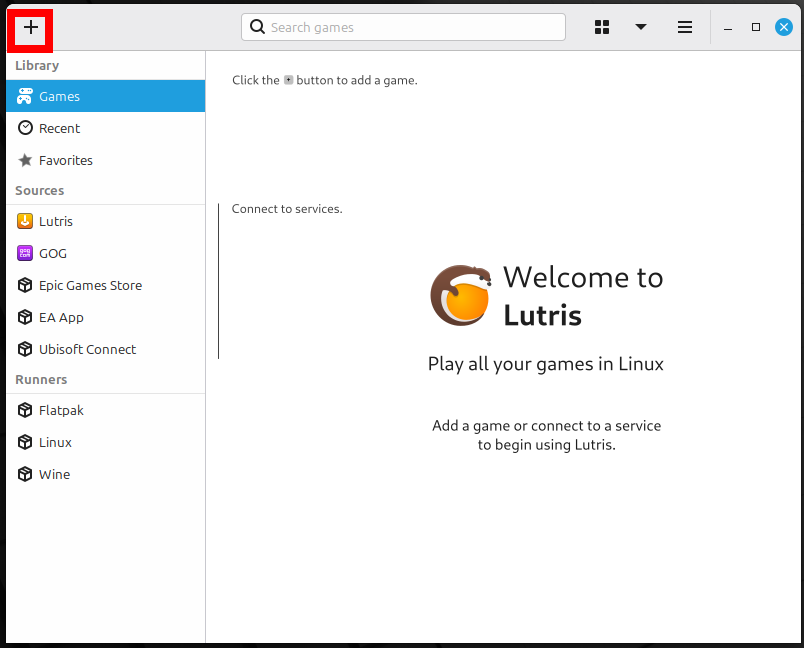

5. Then, choose the Install from a local install script option.
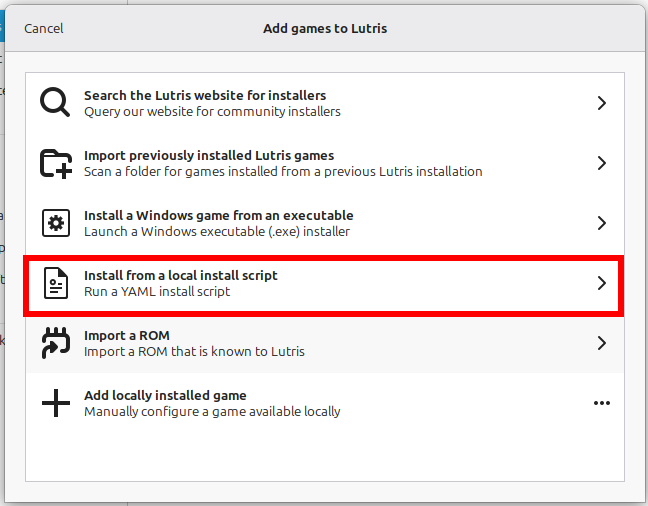

6. Browse for the `test-of-time-install-script.yml` file you just downloaded. Then select the "Install" button in the top right corner.
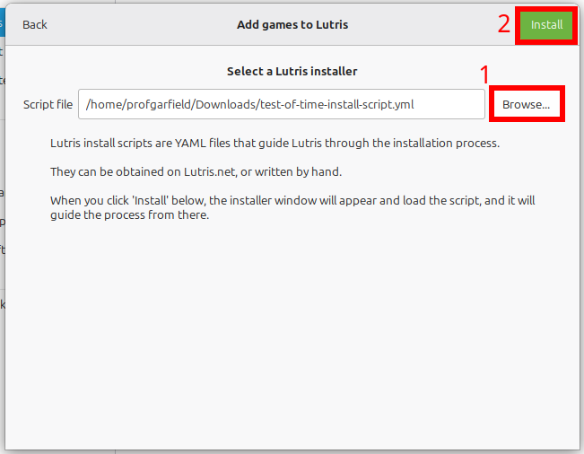

7. Select the "Install" button beside the Install Test of Time with Test of Time Patch Project v0.18.4.
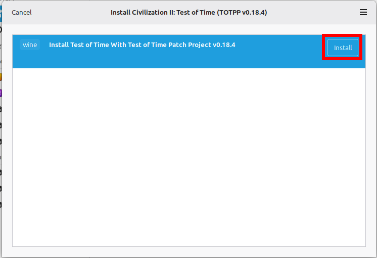

8. Next, you will be prompted to choose an installation directory.  The default should be fine.  If you want to create a menu or desktop shortcut, check the appropriate box now.  Then press the "continue" button in the top right corner.
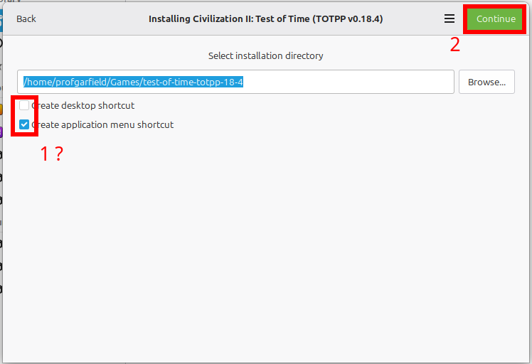

9. It is possible that a version of WINE (software to run Windows programs on Linux) will be automatically downloaded now.
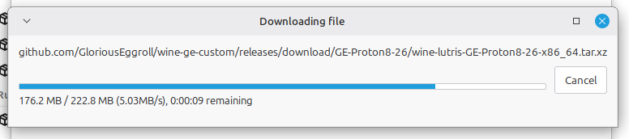

10. You will be asked to review the files for downloading. The first set of files is this repository, which includes several files and patches, which are detailed [below](#explanation-and-original-sources-for-provided-files).
 The second download is my [Extended Music Patch](https://github.com/ProfGarfield/ExtendedMusicForTOTPP).  You will later be given the option of whether you want the extended music features.  Even if you don't, this download provides the original music in .mp3 form, so it is required.
 Press the "Install" button in the top right corner.

11. These files will be downloaded.  You don't have to do anything.
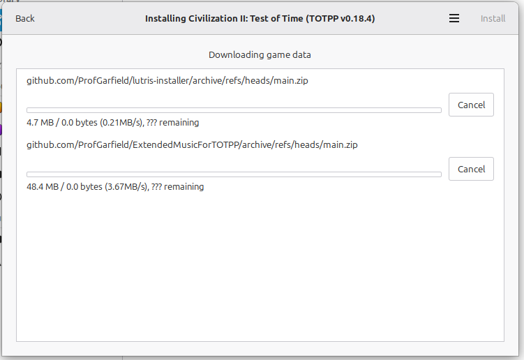

12. Next, you will be asked to select the Test of Time disk or mounted image.  The Autodetect option will probably work, but if it doesn't, you will have to select the mounted image manually, which you can probably find on the left side of the file explorer.  You don't need to actually select `setup.exe` or any other file or folder.
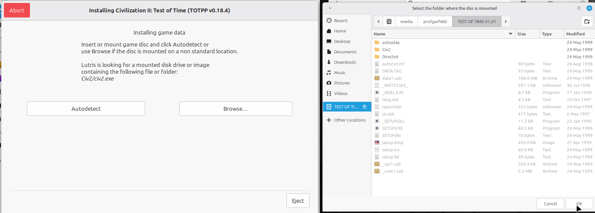

13. Begin the installation and accept the license agreement.
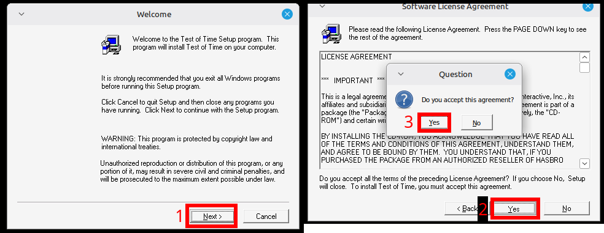

14. IMPORTANT! Install the game to the default directory.  This script will manipulate files expecting the game to be installed to the default path.
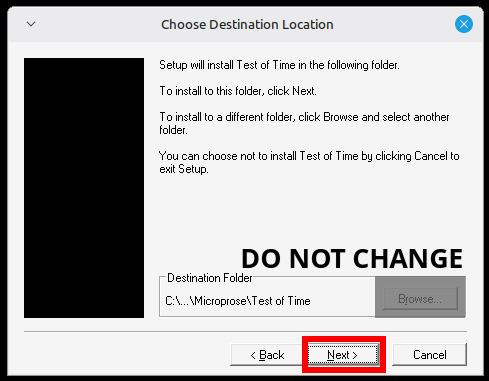

15. As far as I know, any installation should be fine, though I mostly tested on "typical".
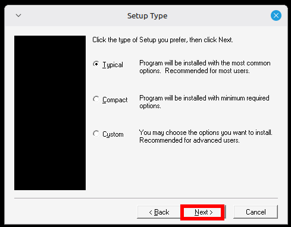

16. In the Select Program Folder menu, keep the default.  I haven't tested any other options, and, in any case, it doesn't impact any menu you will interact with.
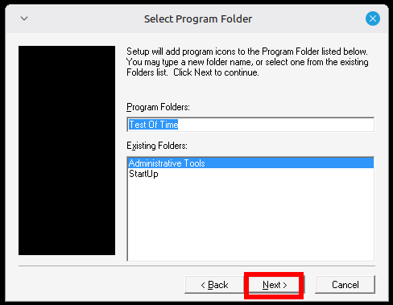

17. Wait for the game to install.
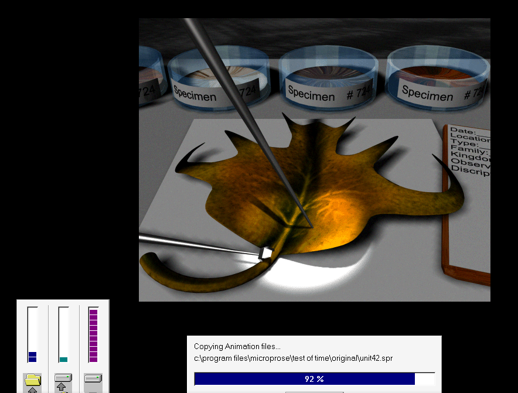

18. Install the DirectX 6 driver when prompted.  As far as I know, you could choose not to, and the game would still work, since the Test of Time Patch Project interfaces with DirectX 9 instead.
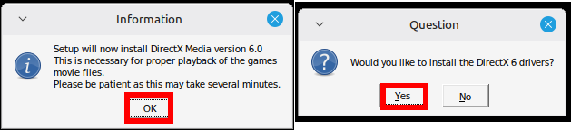

19. Don't try to register the game.
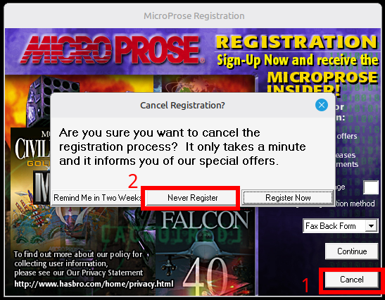

20. Press the "Finish" button to proceed.  Don't try to launch Test of Time yet.
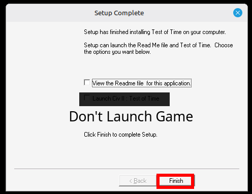

21. The script will next install the official Time Threat Paradox scenario.  This is included in this script, since it must be installed before the version 1.1 patch.  Don't launch the game when the installation is finished.  A readme file will automatically open, so close it to proceed to the next step.
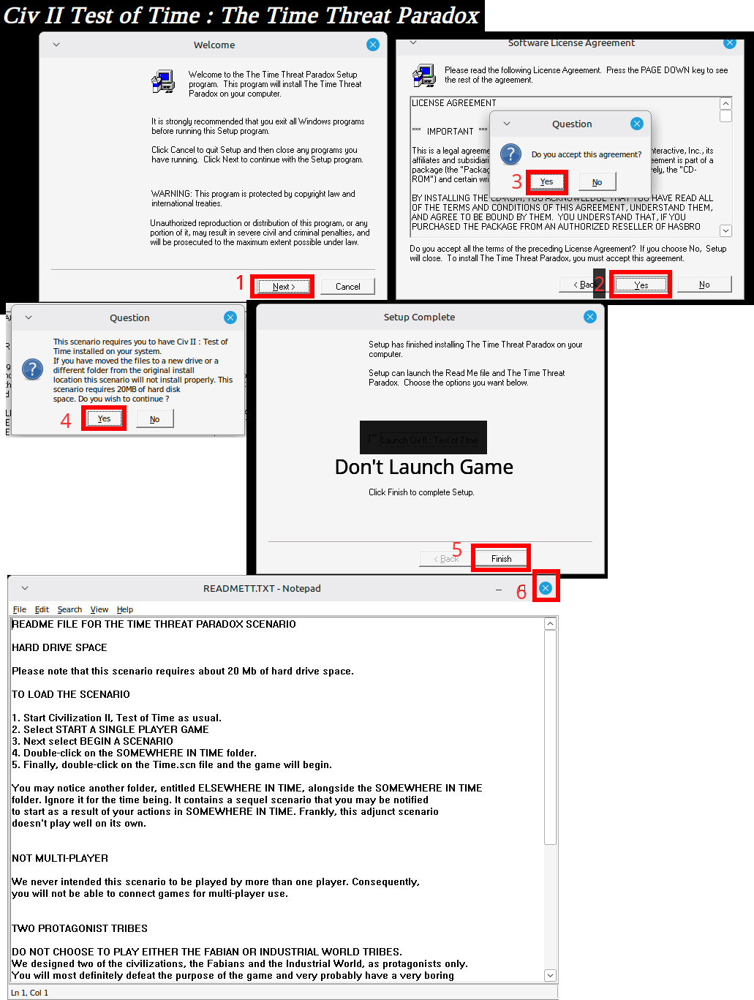

22. Next, the script will install the official version 1.1 patch.  Don't launch the game when this is done.
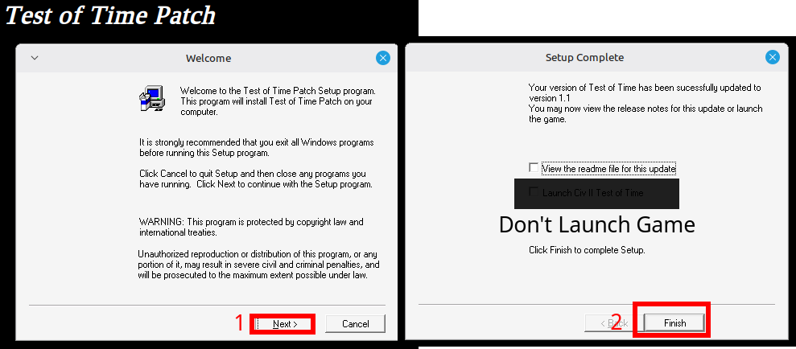

23. At this point, you will be presented with a choice for music options.  If you choose yes for the Extended Music for TOTPP Features, my [Extended Music Patch](https://github.com/ProfGarfield/ExtendedMusicForTOTPP) will be automatically installed, including changing the track lists for the Classic and Fantasy games.  If you choose no, then the .mp3 files for the game music will be copied into the Music folder so that you can play the music that came with the game.
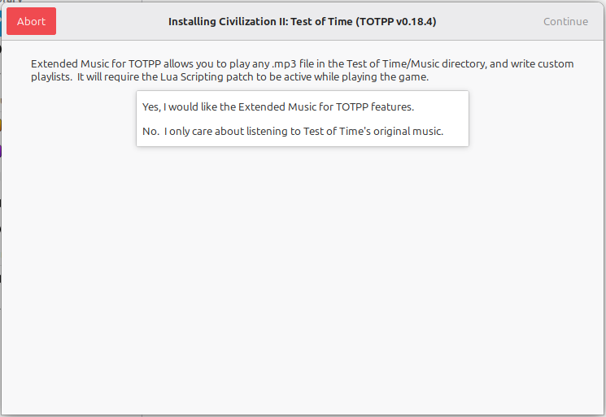

24. At this point, the Lutris script is finished, and this message will be shown.
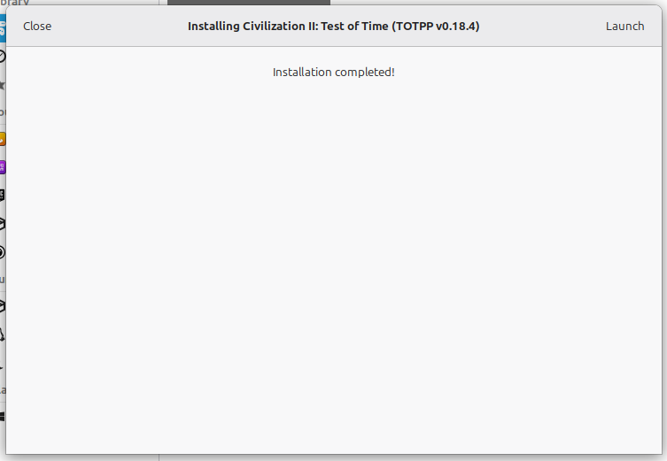

25. We're not done yet, however.  Start Test of Time from the menu, and the Test of Time Patch Project patcher program will start.  Press the "Apply Patch" button in the top right, and create a backup of civ2.exe.
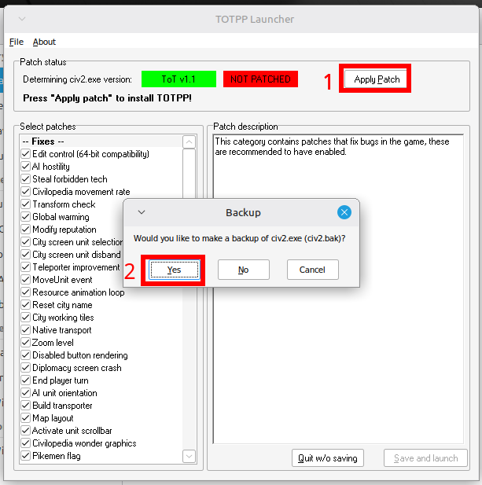

26. There are some patches that are disabled by default that we should enable:
    1. City sprites
    2. DirectShow music
    3. Lua scripting
    4. Lua scenario events
Do not enable the debugging patches.
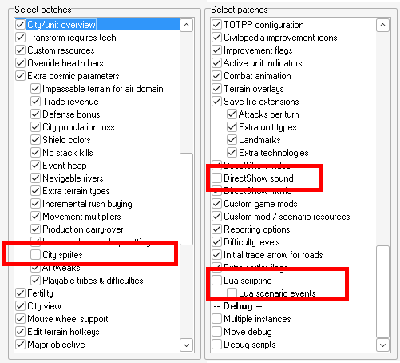

27. Finally, press "Save and Launch" in the bottom right to save these changes to the Test of Time Patch Project and start Test of Time.  Whenever you start Test of Time, this launcher will run first, giving you the opportunity to disable or enable patches.
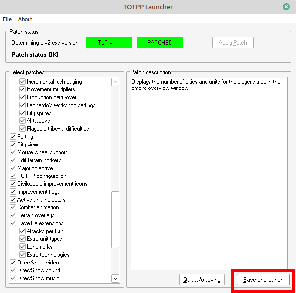

28. You can be finished at this point.  However, if you like, you can configure Lutris to show the Test of Time cover art and menu icon.  Right click on the Test of Time menu option and select configure.
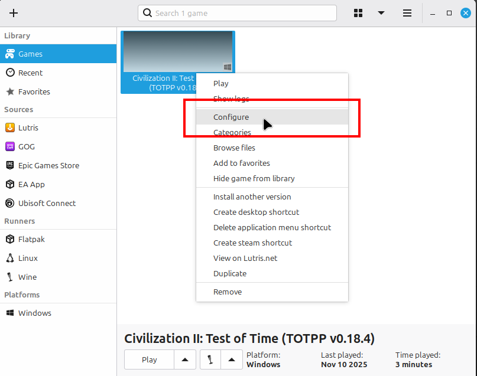

29. Click on the art image that you want to add or change.
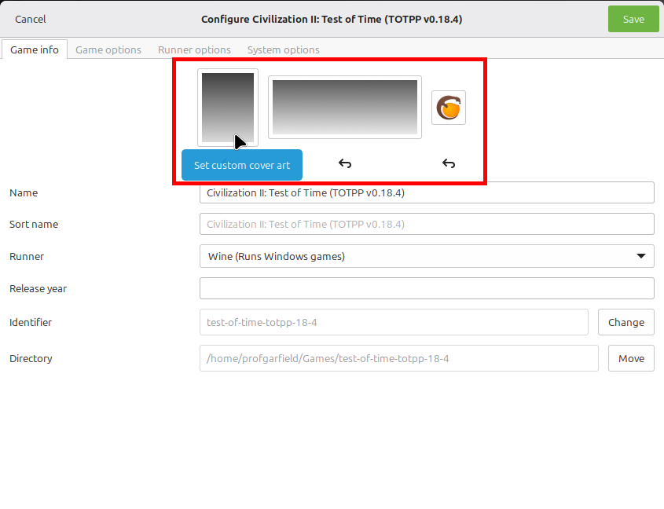

30. If you want to use an image that I've included in with this installer, `/home/<your-name>/Games/test-of-time-totpp-18-4/drive_c/lutris-installer-main` in order to find the images.
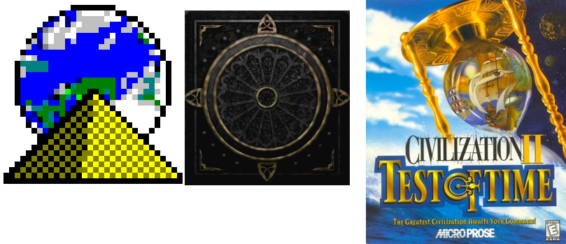
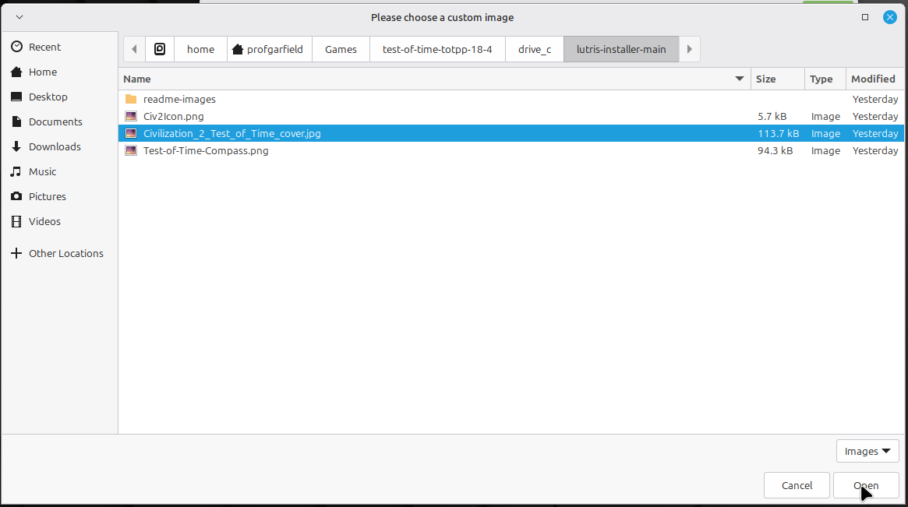

31. Once you are done, you save the configuration.
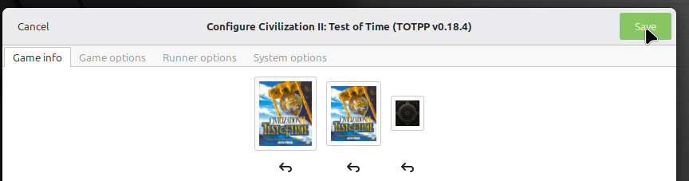

## Explanation and Original Sources for Provided Files

1.  Official Version 1.1 Patch: https://forums.civfanatics.com/resources/test-of-time-v1-1-patch.59/download
 The Test of Time Patch Project expects the game to be patched.
2. Test of Time Patch Project v0.18.4: https://forums.civfanatics.com/attachments/totppv018-4-zip.619222/
3. Catfish's Midgard Patch: Catfish's website is no longer up, but [here](https://foxahead.github.io/Catfish-s-Cave/) is a version built from Wayback Machine data.
 This patches events for the Midgard scenario, in case someone wants to play it.
4. Official Time Threat Paradox Scenario: http://sleague.civfanatics.com/images/2/23/CIVIITTP.rar
 This scenario must be installed before the Version 1.1 patch.  I therefore include it in this installer to make sure it will be playable if the user wants to.
