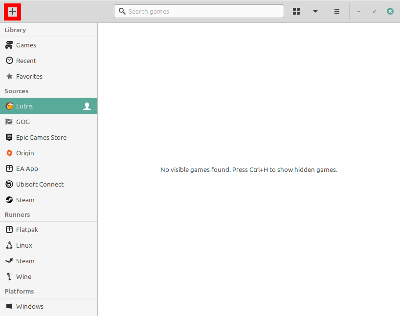
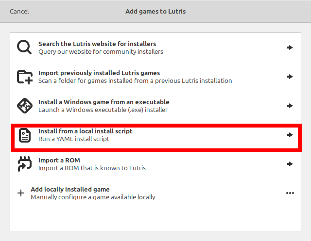
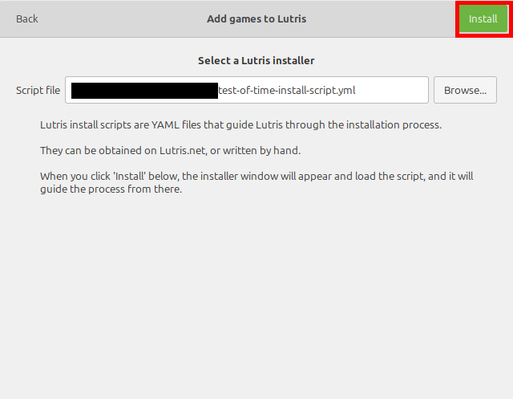
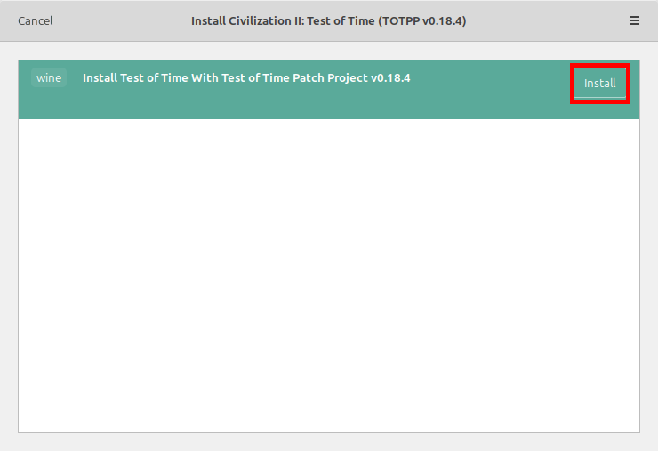

# UNDER CONSTRUCTION

This script (probably) doesn't work yet.  I'll remove this line when it does.  (The Repo has to be public so I can test it...)

# Lutris Installer for Civilization II: Test of Time with Test of Time Patch Project

This file provides a Lutris install script for Civilzation II: Test of Time along with the Test of Time Patch Project (TOTPP) version 0.18.4.  It also provides the option to install my [Extended Music Patch](https://github.com/ProfGarfield/ExtendedMusicForTOTPP), which uses TOTPP's Lua integration to allow the player to play custom tracks as in game music.

I have not added this installer to any installer database.  I have no objection if someone else does this, but I am not responsible for any changes that may be made.

## Instructions

Download the file test-of-time-install-script.yml by clicking [this link](test-of-time-install-script.yml) (test-of-time-install-script.yml) and then choosing the "download raw file" icon:

In Lutris, select the "Add Game" button in the top left corner:

Then, choose the Install from a local install script option.

Select the `test-of-time-install-script.yml` file you just downloaded. Then select the "Install" button in the top right corner.

Select the "Install" button beside the Install Test of Time with Test of Time Patch Project v0.18.4.

During the installation, use the default choices.

## Explanation and Original Sources for Provided Files

1.  Official Version 1.1 Patch: https://forums.civfanatics.com/resources/test-of-time-v1-1-patch.59/download
2. Test of Time Patch Project v0.18.4: https://forums.civfanatics.com/attachments/totppv018-4-zip.619222/
3. Catfish's Midgard Patch: Catfish's website is no longer up, but [here](https://foxahead.github.io/Catfish-s-Cave/) is a version built from Wayback Machine data.
4. Official Time Threat Paradox Scenario: http://sleague.civfanatics.com/images/2/23/CIVIITTP.rar
